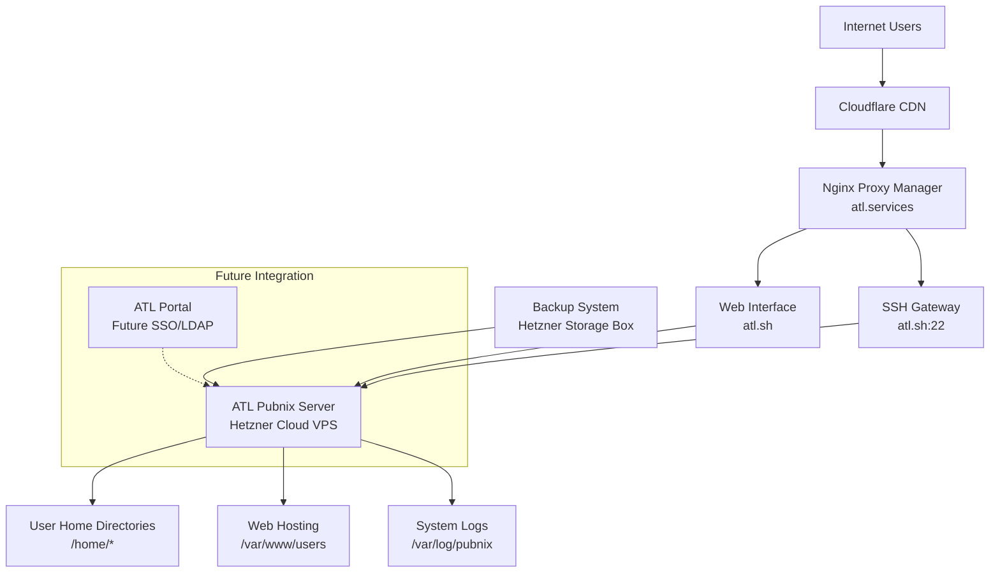

# ATL Pubnix System Design

## Overview

The ATL Pubnix system is designed as a modern implementation of a traditional public access Unix system, built on Debian Linux and deployed on Hetzner Cloud infrastructure. The system emphasizes security, scalability, and community engagement while maintaining the authentic Unix experience that defines pubnix culture.

The architecture follows a modular approach that supports current standalone operation while preparing for future integration with ATL's unified authentication portal. The system balances the open, collaborative nature of traditional pubnix systems with modern security practices and resource management.

## Architecture

### High-Level Architecture



### System Components

1. **Core Pubnix Server**: Debian-based system hosting user accounts and services
2. **Web Interface**: Landing page, signup forms, and user documentation
3. **User Management System**: Account provisioning, resource monitoring, and administration tools
4. **Resource Management**: CPU, memory, disk, and process limiting systems
5. **Security Layer**: SSH hardening, intrusion detection, and access controls
6. **Backup System**: Automated backups to Hetzner Storage Box
7. **Monitoring Stack**: System health, user activity, and resource usage tracking

## Components and Interfaces

### User Management Component

**Purpose**: Handle user lifecycle from application to account termination

**Key Interfaces**:
- Web-based application form
- Administrative approval workflow
- Automated account provisioning
- User modification and suspension tools

**Implementation Details**:
- SQLite database for user metadata and application tracking
- Shell scripts for account creation using `useradd` with custom configurations
- Web interface built with lightweight framework (Flask/FastAPI)
- Email integration for notifications
- Future LDAP/SSO integration hooks via pluggable authentication backends

### Resource Management Component

**Purpose**: Ensure fair resource usage and system stability

**Key Interfaces**:
- Per-user resource limits enforcement
- Real-time monitoring and alerting
- Administrative override capabilities
- Usage reporting and analytics

**Implementation Details**:
- systemd user slices for CPU and memory limits
- Disk quotas using Linux quota system
- Process limits via PAM and systemd
- Custom monitoring daemon collecting usage metrics
- Automated throttling and suspension for policy violations

### Web Hosting Component

**Purpose**: Serve user-generated web content

**Key Interfaces**:
- File-based content serving from `~/public_html`
- URL routing to `atl.sh/~username`
- CGI script execution for dynamic content
- Content moderation tools

**Implementation Details**:
- Apache or Nginx with user directory modules
- Sandboxed CGI execution environment
- File type and size restrictions
- Automated content scanning for policy violations
- Integration with main ATL reverse proxy infrastructure

### Security Component

**Purpose**: Maintain system security and prevent abuse

**Key Interfaces**:
- SSH access controls and key management
- Intrusion detection and response
- Security policy enforcement
- Audit logging and compliance

**Implementation Details**:
- SSH hardening with key-only authentication
- fail2ban for brute force protection
- AppArmor/SELinux profiles for user processes
- Centralized logging with log rotation
- Regular security updates via unattended-upgrades

### Communication Component

**Purpose**: Enable traditional Unix social features

**Key Interfaces**:
- Inter-user messaging (write, wall, talk)
- User discovery and presence (who, finger, w)
- Bulletin board systems
- Shared collaboration spaces

**Implementation Details**:
- Traditional Unix utilities with modern security enhancements
- Custom bulletin board system using filesystem-based storage
- Shared directories with appropriate permissions
- Integration with ATL Discord community (future enhancement)

## Data Models

### User Account Model

```
User {
    username: string (unique, 3-32 chars, alphanumeric + underscore)
    email: string (unique, validated)
    full_name: string
    application_date: timestamp
    approval_date: timestamp
    status: enum (pending, approved, suspended, terminated)
    home_directory: string (path)
    shell: string (default: /bin/bash)
    resource_limits: ResourceLimits
    last_login: timestamp
    created_by: string (admin username)
}

ResourceLimits {
    disk_quota_mb: integer (default: 1024)
    max_processes: integer (default: 50)
    cpu_limit_percent: integer (default: 10)
    memory_limit_mb: integer (default: 512)
    max_login_sessions: integer (default: 5)
}

Application {
    id: integer (auto-increment)
    email: string
    username_requested: string
    full_name: string
    motivation: text
    community_guidelines_accepted: boolean
    application_date: timestamp
    status: enum (pending, approved, rejected)
    reviewed_by: string (admin username)
    review_date: timestamp
    review_notes: text
}
```

### System Metrics Model

```
SystemMetrics {
    timestamp: timestamp
    total_users: integer
    active_users_24h: integer
    cpu_usage_percent: float
    memory_usage_percent: float
    disk_usage_percent: float
    network_connections: integer
}

UserMetrics {
    username: string
    timestamp: timestamp
    cpu_time_seconds: integer
    memory_usage_mb: integer
    disk_usage_mb: integer
    active_processes: integer
    login_sessions: integer
    last_activity: timestamp
}
```

## Error Handling

### User-Facing Errors

1. **Authentication Failures**
   - SSH key rejection: Clear error message with key format guidance
   - Account suspension: Informative message with contact information
   - Resource limits exceeded: Specific limit information and resolution steps

2. **Resource Exhaustion**
   - Disk quota exceeded: Clear quota information and cleanup suggestions
   - Process limit reached: Process management guidance
   - Memory limits: Optimization recommendations

3. **Web Hosting Issues**
   - File upload failures: Size and type restriction explanations
   - CGI execution errors: Debugging information and documentation links
   - Content policy violations: Clear policy explanation and appeal process

### System-Level Error Handling

1. **Service Failures**
   - Graceful degradation when non-critical services fail
   - Automatic service restart with exponential backoff
   - Administrator alerting for persistent failures

2. **Resource Monitoring**
   - Automated response to resource exhaustion
   - Proactive user notification before limits are reached
   - Emergency procedures for system-wide resource issues

3. **Security Incidents**
   - Automated response to detected intrusions
   - Account lockdown procedures for compromised accounts
   - Incident logging and forensic data preservation

## Testing Strategy

### Unit Testing

1. **User Management Functions**
   - Account creation and modification workflows
   - Resource limit enforcement mechanisms
   - Authentication and authorization logic

2. **Resource Monitoring**
   - Quota calculation accuracy
   - Limit enforcement triggers
   - Metric collection and aggregation

3. **Security Components**
   - Access control validation
   - Input sanitization and validation
   - Audit logging completeness

### Integration Testing

1. **End-to-End User Workflows**
   - Complete signup and onboarding process
   - SSH access and basic system usage
   - Web hosting functionality and content serving

2. **Administrative Workflows**
   - User approval and provisioning
   - Resource monitoring and limit enforcement
   - System maintenance and backup procedures

3. **Security Testing**
   - Penetration testing of SSH and web interfaces
   - Resource limit bypass attempts
   - Social engineering and policy violation scenarios

### Performance Testing

1. **Load Testing**
   - Concurrent SSH session handling
   - Web traffic serving capacity
   - Database performance under load

2. **Resource Testing**
   - System behavior under resource exhaustion
   - User limit enforcement accuracy
   - Backup and recovery performance

3. **Scalability Testing**
   - User growth simulation
   - Infrastructure scaling procedures
   - Migration and upgrade processes

### Deployment Testing

1. **Infrastructure Validation**
   - Hetzner Cloud deployment automation
   - Network connectivity and routing
   - DNS configuration and SSL certificates

2. **Backup and Recovery**
   - Backup system functionality and integrity
   - Disaster recovery procedures
   - Data migration and system restoration

3. **Monitoring and Alerting**
   - Metric collection accuracy
   - Alert threshold validation
   - Administrative notification systems

## Security Considerations

### Access Control

- SSH-only access with mandatory key authentication
- Regular SSH key rotation recommendations
- Multi-factor authentication for administrative accounts
- Network-level access controls via iptables/nftables

### User Isolation

- Strict file system permissions and umask enforcement
- Process isolation using systemd user slices
- Network namespace isolation for enhanced security
- AppArmor profiles for common user applications

### System Hardening

- Minimal package installation following principle of least privilege
- Regular security updates via automated patching
- Intrusion detection using fail2ban and custom monitoring
- Comprehensive audit logging with tamper protection

### Data Protection

- Encrypted backups to Hetzner Storage Box
- User data privacy protection and GDPR compliance
- Secure deletion procedures for terminated accounts
- Regular security audits and vulnerability assessments

## Monitoring and Observability

### System Metrics

- CPU, memory, disk, and network utilization
- User activity and resource consumption
- Service availability and response times
- Security events and policy violations

### User Experience Metrics

- Login success rates and session duration
- Web hosting usage and performance
- Community engagement and feature adoption
- Support request volume and resolution times

### Administrative Dashboards

- Real-time system health overview
- User management and approval queues
- Resource usage trends and capacity planning
- Security incident tracking and response

This design provides a solid foundation for building a modern, secure, and scalable pubnix system that honors the traditional Unix community culture while meeting contemporary operational requirements.